<!-- hanging ID badge (hand-authored SVG — swings + animates on GitHub) -->
<p align="center">
  
</p>

<p align="center">
  
  
  
  <a href="https://linkedin.com/in/krishhpandit"></a>
  <a href="mailto:krishhhpandit5@gmail.com"></a>
</p>

---

## 📋 Model Description

`krish-pandit-2027` is an AI/ML engineer checkpoint out of **Gurugram, India** 🇮🇳, currently fine-tuning at **NorthCap University** (B.Tech CS, `2027`). Ships GenAI that reaches **prod**, not just a Jupyter notebook that runs once and never again.

Turns *"can AI even do this?"* into *"yeah, deployed it — check the PR."* Fluent in Python, LangChain, and mild panic.

```yaml
tags: [ llm-whisperer, rag-pilled, agent-brained, ships-to-prod, computer-vision ]
languages: [ python, sql, java ]
base_model: caffeine + curiosity
```

## 🎯 Intended Use

- 🤖  Building **LLM / RAG systems** and modular **AI agents** that survive contact with real users
- 🧩  Wiring **hybrid setups** (local `Ollama` + cloud APIs) when privacy and performance both want a seat at the table
- ⚡  Automating the boring stuff with `n8n` pipelines — OCR, ingestion, "why is this still manual" energy
- 👁️  Training **computer vision** models that hit real accuracy, not just leaderboard vibes

## ⚠️ Limitations & Known Behaviors

- Performance degrades sharply without coffee ☕ — documented, not a bug
- Will aggressively try to automate your manual process. You have been warned.
- Occasionally over-optimizes latency for fun (see benchmarks below, no regrets)

## 📚 Training Data

| Split | Source | Notes |
|---|---|---|
| **Pretraining** | B.Tech CS @ NorthCap University | `2023 → 2027` |
| **Fine-tune** | GenAI & Ops Intern @ **PeakPals** | built *CreatorPal* — voice + chatbot AI platform, front to back |
| **Fine-tune** | Python Dev Intern @ **The Law Brain** | AI legal automation w/ LangChain, hybrid LLM architecture, n8n OCR pipelines |
| **Extracurricular** | Hackathon Organizer & Lead | ran a college hackathon end-to-end |

## 🧪 Evaluation / Benchmarks

> receipts, not vibes.

**🌾 Smart Crop Health Monitor** — `TensorFlow` · `Computer Vision` · `Flask`
```text
accuracy      ▸ ~99.0%  (EfficientNetV2-S, 54,305 imgs, 38 classes)
latency       ▸ ▼ 50%   (FP16 + Metal GPU + TFLite INT8)
beat          ▸ MobileNetV2 & ResNet baselines
```

**💭 DreamScript — AI Dream Analyzer** — `NLP` · `NLTK` · `SQL` · `Matplotlib`
```text
lexicon       ▸ 3,000+ symbolic keywords
logging       ▸ 45-day longitudinal tracking
output        ▸ mood-trend + recurring-symbol viz
```

## 🧰 Architecture / Stack

<p>
  
  
  
  
  
  
  
  
  
  
  
  
  
  
</p>

## 📈 Live Telemetry

<p align="center">
  
  
</p>

## 🤝 How to Run Inference

```python
krish = load_model("m1ssmee")
krish.prompt("let's build something intelligent")
# → responds within one business day, usually faster
```

<p align="center">
  <a href="https://linkedin.com/in/krishhpandit"></a>
  <a href="mailto:krishhhpandit5@gmail.com"></a>
  
</p>
